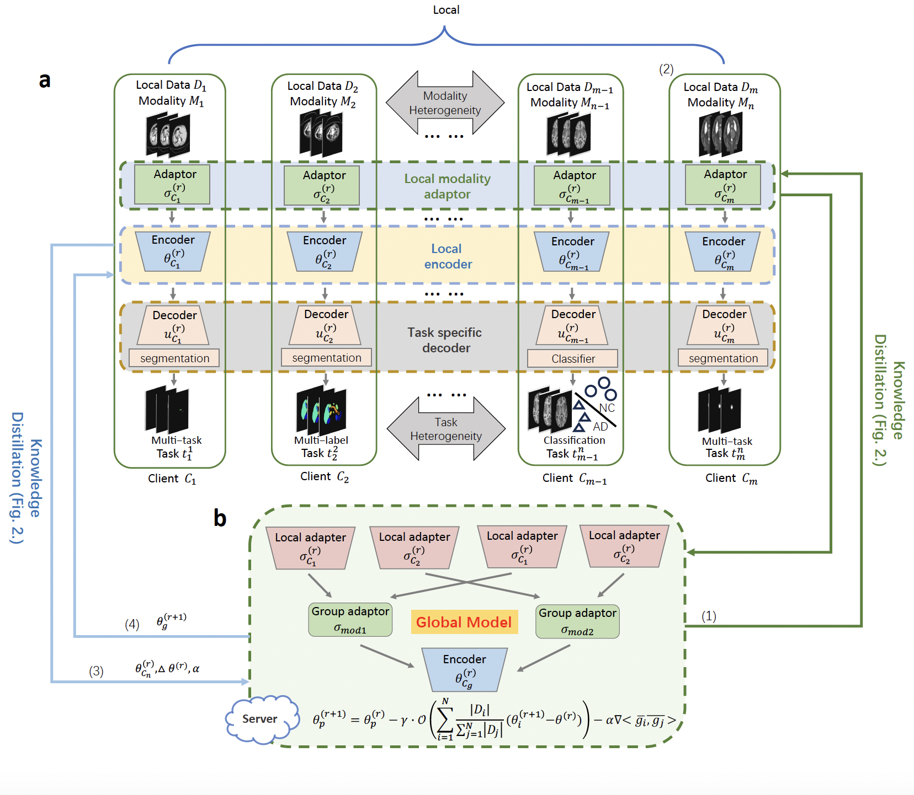

### Multi-Modality Federated Learning with Adaptive Updates for Heterogeneous Medical Image Tasks
([To be updated](https://To_be_updated))

###### Abstract:
> Federated learning (FL) enables collaborative model training across decentralized medical datasets while preserving patient privacy. However, its practical application remains limited by data heterogeneity—specifically, differences in imaging modalities (e.g., CT, MRI) and tasks (e.g., segmentation vs. classification) across participating institutions. These variations pose significant challenges for jointly learning a unified global model for medical image analysis tasks that generalizes across clients.
To overcome these challenges, we propose FedCMT, a federated cross-modality and multi-task learning framework that adaptively aggregates heterogeneous client models. Methodologically, FedCMT integrates three key components: (1) personalized adaptors and decoders to capture local, modality- and task-specific features; (2) a conflict-averse module to extract modality-invariant representations and mitigate inter-client feature conflicts; and (3) an adaptive aggregation strategy that dynamically incorporates new tasks and modalities without retraining the entire federation. This design allows FedCMT to maintain stability and scalability while fostering shared knowledge across diverse medical imaging domains. 
We evaluate FedCMT on ten CT and MR datasets involving up to eight federated clients performing segmentation and classification tasks. Experimental results demonstrate that FedCMT consistently outperforms state-of-the-art FL baselines, achieving up to 6.3\% improvement in Dice score compared to conventional approaches. On average, FedCMT improves performance by 4.15\% over FedAVG, 2.75\%  over FedOPT, and 3.52\% over FedHCA, confirming its effectiveness in addressing modality and task heterogeneity. These findings highlight FedCMT as a significant step toward scalable and adaptable federated learning for real-world medical image analysis.

|  |
|:-------------------------------------------------------------------------------------:|
| Fig 1. Overview of the FedCMT framework under multimodal and heterogeneous task settings.|

## License
The code in this directory is released under Apache v2 License.


## Data Preparation
Download the dataset and organize it according to the nnU-Net required directory structure. nnU-Net expects all datasets to follow a standardized format that includes raw images, labels, and dataset metadata
```text
nnUNet_raw/
└── DatasetXXX_MyDataset/
    ├── imagesTr/
    ├── imagesTs/
    ├── labelsTr/
    ├── dataset.json
```

And then run the code for pre-processing:
```
python src/script_preprocess.py -d DATASET_ID
```


## Run

### Training

To run FedCMT, use `start_fl.sh` with specific jobs you would like to run.
```
bash start_fl.sh brats_sdl
```
The training logs and results will be saved in `workspace`.
The user can use TensorBoard to monitor the training.
```
tensorboard --logdir workspace/simulate_job
```

### Validation
The validation is performed after each trainer.

### Inference

The inference is performed separately with `Inference.py`. 
The inference results will be saved in the nnUnet-result directory in NIfTI format.

```
python Inference.py --workspace workspace/job_name --clients  app_client1    --gpu_ids 0
```


## Citation

> Wenwen, Zhang, et al. "Multi-Modality Federated Learning with Adaptive Updates for Heterogeneous Medical Image Tasks."

BibTeX
```
@article{WenwenFedCMT,
  title={Multi-Modality Federated Learning with Adaptive Updates for Heterogeneous Medical Image Tasks},
  author={Wenwen Zhang, Zhenyu Tang, Hao Zhang, Shaohao Rui, Jane Z. Wang and Xiaosong Wang},
  journal={To be updated},
  year={2025}
}
```
